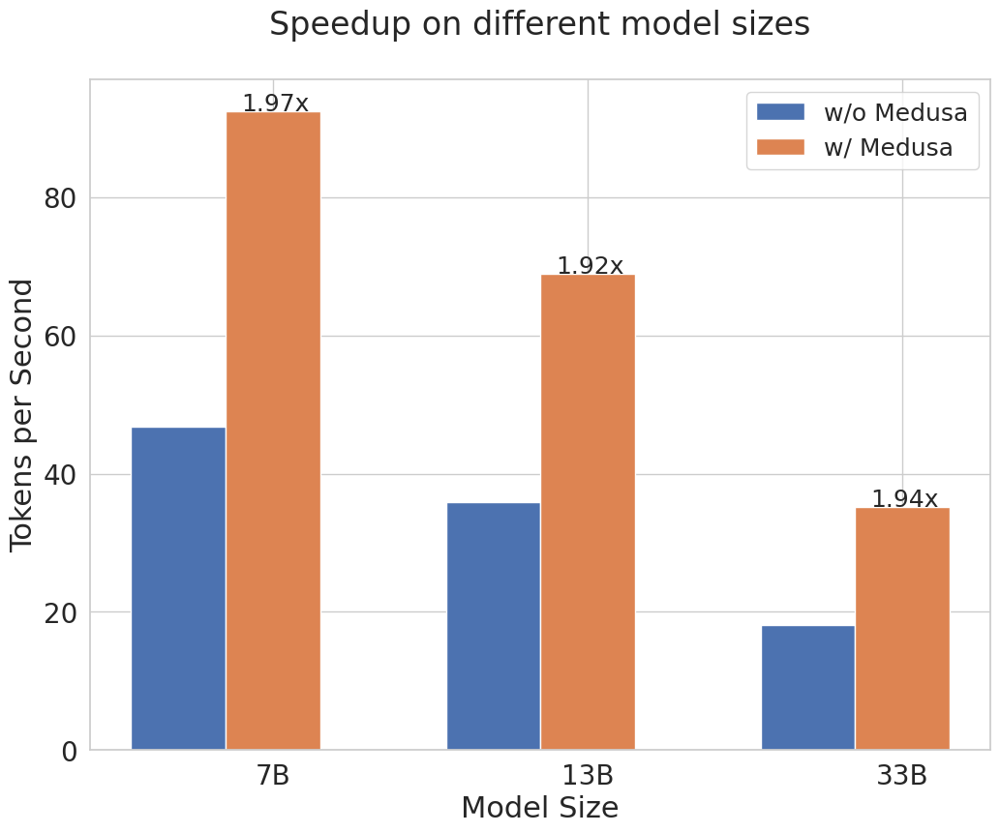

<div align="center"><h1>&nbsp;Medusa: Simple Framework for Accelerating LLM Generation with Multiple Decoding Heads</h1></div>

<p align="center">
| <a href="https://sites.google.com/view/
medusa-llm"><b>Blog</b></a> | <a href="ROADMAP.md"><b>Roadmap</b></a> |
</p>

---
*News* 🔥
- [2023/09] Medusa v0.1 is released! 🎉

---
## Introduction

Medusa is a simple framework that democratizes the acceleration techniques for LLM generation with multiple decoding heads.

<div align="center">
  <picture>
  
  </picture>
  <br>
  <div align="center" width="80%">
  <em>Medusa on Vicuna-7b.</em>
  </div>
  <br>
</div>


We aim to tackle the three pain points of popular acceleration techniques like speculative decoding:

- Requirement of a good draft model.
- System complexity.
- Inefficiency when using sampling-based generation.


<div align="center">
  <picture>
  
  </picture>
  <br>
  <div align="left" width="80%">
  <em>Medusa adds extra "heads" to LLMs to predict multiple future tokens simultaneously. When augmenting a model with Medusa, the original model stays untouched, and only the new heads are fine-tuned during training. During generation, these heads each produce multiple likely words for the corresponding position. These options are then combined and processed using a tree-based attention mechanism. Finally, a typical acceptance scheme is employed to pick the longest plausible prefix from the candidates for further decoding.</em>
  </div>
  <br>
</div>

We aim to solve the challenges associated with speculative decoding by implementing the following ideas:

- Instead of introducing a new model, we train multiple decoding heads on the *same* model.
- The training is parameter-efficient so that even the "GPU-Poor" can do it. And since there is no additional model, there is no need to adjust the distributed computing setup.
- Relaxing the requirement of matching the distribution of the original model makes the non-greedy generation even faster than greedy decoding.
<p align="center">
  <picture>
  
  </picture>
</p>
In this initial release, our primary focus is on optimizing Medusa for a batch size of 1—a setting commonly utilized for local model hosting. In this configuration, Medusa delivers approximately a 2x speed increase across a range of Vicuna models. We are actively working to extend Medusa's capabilities by integrating it into additional inference frameworks, with the aim of achieving even greater performance gains and extending Medusa to broader settings.

## Contents
- [Introduction](#introduction)
- [Contents](#contents)
- [Installation](#installation)
  - [Method 1: With pip](#method-1-with-pip)
  - [Method 2: From source](#method-2-from-source)
  - [Model Weights](#model-weights)
  - [Inference](#inference)
  - [Training](#training)
    - [Prepare the data](#prepare-the-data)
    - [Train the model](#train-the-model)
    - [Push to Hugging Face Hub](#push-to-hugging-face-hub)
- [Citation](#citation)
- [Codebase Guide](#codebase-guide)
- [Contributing](#contributing)
- [Acknowledgements](#acknowledgements)

## Installation
### Method 1: With pip
```bash
pip install medusa-llm
```
### Method 2: From source
```bash
git clone https://github.com/FasterDecoding/Medusa.git
cd Medusa
pip install -e .
```

### Model Weights
| Size | Chat Command                                  | Hugging Face Repo                                                     |
| ---- | --------------------------------------------- | --------------------------------------------------------------------- |
| 7B   | `python -m medusa.inference.cli --model FasterDecoding/medusa-vicuna-7b-v1.3` | [FasterDecoding/medusa-vicuna-7b-v1.3](https://huggingface.co/FasterDecoding/medusa-vicuna-7b-v1.3)   |
| 13B  | `python -m medusa.inference.cli --model FasterDecoding/medusa-vicuna-13b-v1.3` | [FasterDecoding/medusa-vicuna-13b-v1.3](https://huggingface.co/FasterDecoding/medusa-vicuna-13b-v1.3) |
| 33B  | `python -m medusa.inference.cli --model FasterDecoding/medusa-vicuna-33b-v1.3` | [FasterDecoding/medusa-vicuna-33b-v1.3](https://huggingface.co/FasterDecoding/medusa-vicuna-33b-v1.3) |

### Inference
We currently support single-GPU inference with a batch size of 1, which is the most common setup for local model hosting. We are actively working to extend Medusa's capabilities by integrating it into other inference frameworks; please don't hesitate to reach out if you are interested in contributing to this effort.

You can use the following command for launching a CLI interface:
```bash
CUDA_VISIBLE_DEVICES=0 python -m medusa.inference.cli --model [path of medusa model]
```
You can also pass `--load-in-8bit` or `--load-in-4bit` to load the base model in quantized format.

### Training
For training, please install:
```bash
pip install -e ".[train]"
```
#### Prepare the data
We take a public version of the ShareGPT dataset, which is a subset of the Vicuna training data. For other models, you can use the corresponding training dataset.
```bash
git clone https://huggingface.co/datasets/Aeala/ShareGPT_Vicuna_unfiltered
```
#### Train the model
We follow the training setup from [FastChat](https://github.com/lm-sys/FastChat#fine-tuning), but with a much larger learning rate because we freeze the original model and only train the new heads. Here is the training command for the Vicuna-7b model on 4 GPUs. Since we are only training the new heads, the training does not require a lot of memory, and only data parallelism is needed. You can modify the script to fit your own setup. For larger models, we use the same setup. You can also use `--load_in_8bit` or `--load_in_4bit` to load the base model in quantized format.
```bash
torchrun --nproc_per_node=4 medusa/train/train.py --model_name_or_path lmsys/vicuna-7b-v1.3 \
    --data_path ShareGPT_Vicuna_unfiltered/ShareGPT_V4.3_unfiltered_cleaned_split.json \
    --bf16 True \
    --output_dir test \
    --num_train_epochs 1 \
    --per_device_train_batch_size 8 \
    --per_device_eval_batch_size 8 \
    --gradient_accumulation_steps 4 \
    --evaluation_strategy "no" \
    --save_strategy "no" \
    --learning_rate 1e-3 \
    --weight_decay 0.0 \
    --warmup_ratio 0.1 \
    --lr_scheduler_type "cosine" \
    --logging_steps 1 \
    --tf32 True \
    --model_max_length 2048 \
    --lazy_preprocess True \
    --medusa_num_heads 3 \
    --medusa_num_layers 1
```
#### Push to Hugging Face Hub
You can use the following command to push your model to the Hugging Face Hub:
```bash
python -m medusa.hf_utils --folder [path of the model folder] --repo [name of the repo]
```

## Citation
```bibtex
@misc{medusa,
  author = {Tianle Cai and Yuhong Li and Zhengyang Geng and Hongwu Peng and Tri Dao},
  title = {Medusa: Simple Framework for Accelerating LLM Generation with Multiple Decoding Heads},
  year = {2023},
  publisher = {GitHub},
  journal = {GitHub repository},
  howpublished = {\url{https://github.com/FasterDecoding/Medusa}},
}
```

## Codebase Guide
`medusa/model/medusa_model.py` is the key file for Medusa. It contains the `MedusaModel` class, which is a wrapper of the original model and the new heads. This class also has implementation of a streaming generation method. If you want to dive into the details of Medusa, this is the place to start.

We also provide some illustrative notebooks in `notebooks/` to help you understand the codebase.

## Contributing
We welcome community contributions to Medusa. If you have an idea for how to improve it, please open an issue to discuss it with us. When submitting a pull request, please ensure that your changes are well-tested. Please split each major change into a separate pull request. We also have a [Roadmap](ROADMAP.md) summarizing our future plans for Medusa. Don't hesitate to reach out if you are interested in contributing to any of the items on the roadmap.

## Acknowledgements
This codebase is influenced by remarkable projects from the LLM community, including [FastChat](https://github.com/lm-sys/FastChat), [TinyChat](https://github.com/mit-han-lab/llm-awq/tree/main/), [vllm](https://github.com/vllm-project/vllm) and many others.
