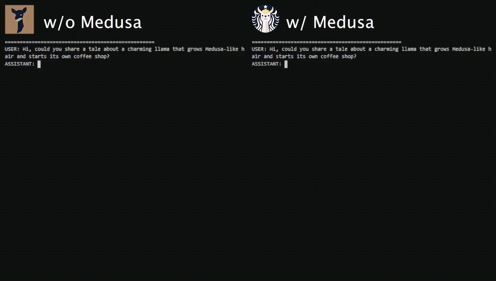
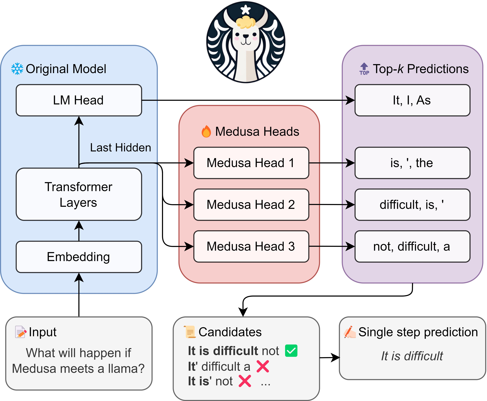
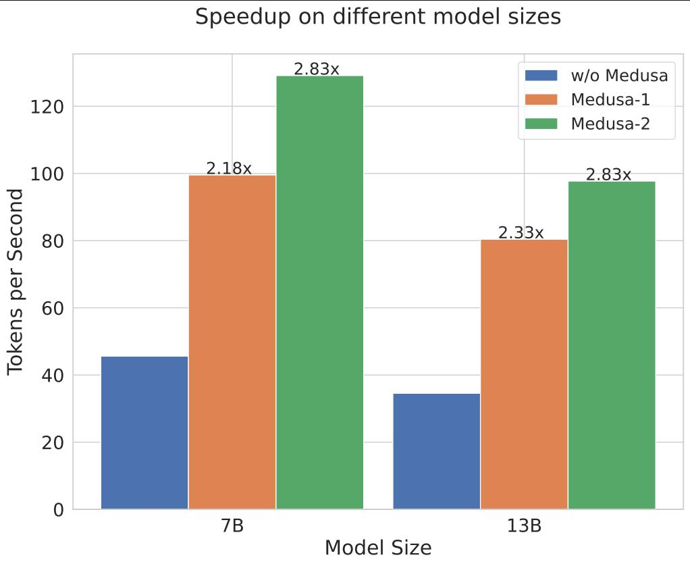

<div align="center"><h1>&nbsp;Medusa: Simple Framework for Accelerating LLM Generation with Multiple Decoding Heads</h1></div>

<p align="center">
| <a href="https://sites.google.com/view/
medusa-llm"><b>Blog</b></a> | <a href="https://arxiv.org/abs/2401.10774"><b>Report</b></a> | <a href="ROADMAP.md"><b>Roadmap</b></a> |
</p>

---
*News* 🔥
- [2024/1] Medusa technical report is now available on [arXiv](https://arxiv.org/abs/2401.10774). We've added multiple new features, including Medusa-2 recipe for full-model training, self-distillation for adding Medusa to any fine-tuned LLM, etc. The new results show a 2.2-3.6x speedup over the original model on a range of LLMs.

---
## Introduction

Medusa is a simple framework that democratizes the acceleration techniques for LLM generation with multiple decoding heads.

<div align="center">
  <picture>
  
  </picture>
  <br>
  <div align="center" width="80%">
  <em>Medusa-1 on Vicuna-7b.</em>
  </div>
  <br>
</div>


We aim to tackle the three pain points of popular acceleration techniques like speculative decoding:

- Requirement of a good draft model.
- System complexity.
- Inefficiency when using sampling-based generation.


<div align="center">
  <picture>
  
  </picture>
  <br>
  <div align="left" width="80%">
  <em>Medusa adds extra "heads" to LLMs to predict multiple future tokens simultaneously. When augmenting a model with Medusa, the original model stays untouched, and only the new heads are fine-tuned during training. During generation, these heads each produce multiple likely words for the corresponding position. These options are then combined and processed using a tree-based attention mechanism. Finally, a typical acceptance scheme is employed to pick the longest plausible prefix from the candidates for further decoding.</em>
  </div>
  <br>
</div>

We aim to solve the challenges associated with speculative decoding by implementing the following ideas:

- Instead of introducing a new model, we train multiple decoding heads on the *same* model.
- The training is parameter-efficient so that even the "GPU-Poor" can do it. And since there is no additional model, there is no need to adjust the distributed computing setup.
- Relaxing the requirement of matching the distribution of the original model makes the non-greedy generation even faster than greedy decoding.

In the initial release, our primary focus is on optimizing Medusa for a batch size of 1—a setting commonly utilized for local model hosting. In this configuration, Medusa delivers approximately a 2x speed increase across a range of Vicuna models. We are actively working to extend Medusa's capabilities by integrating it into additional inference frameworks, with the aim of achieving even greater performance gains and extending Medusa to broader settings.

<p align="center">
  <picture>
  
  </picture>
</p>

In the updated version, we add support for full-model training, called Medusa-2 (compared to Medusa-1, which only trains the new heads), which requires a special recipe that adds the speculative prediction ability while keeping the original model's performance.

We also add support for self-distillation, which allows us to add Medusa to any fine-tuned LLM without requiring the availability of the original training data.

## Contents
- [Introduction](#introduction)
- [Contents](#contents)
- [Installation](#installation)
  - [Method 1: With pip (may not be the latest version)](#method-1-with-pip-may-not-be-the-latest-version)
  - [Method 2: From the source (recommended)](#method-2-from-the-source-recommended)
  - [Model Weights](#model-weights)
  - [Inference](#inference)
  - [Training](#training)
  - [Training (legacy)](#training-legacy)
  - [Push to Hugging Face Hub](#push-to-hugging-face-hub)
- [Citation](#citation)
- [Codebase Guide](#codebase-guide)
- [Community Adoption](#community-adoption)
- [Contributing](#contributing)
- [Acknowledgements](#acknowledgements)

## Installation
### Method 1: With pip (may not be the latest version)
```bash
pip install medusa-llm
```
### Method 2: From the source (recommended)
```bash
git clone https://github.com/FasterDecoding/Medusa.git
cd Medusa
pip install -e .
```

### Model Weights
#### Medusa-1
| Size | Chat Command                                  | Hugging Face Repo                                                     |
| ---- | --------------------------------------------- | --------------------------------------------------------------------- |
| 7B   | `python -m medusa.inference.cli --model FasterDecoding/medusa-vicuna-7b-v1.3` | [FasterDecoding/medusa-vicuna-7b-v1.3](https://huggingface.co/FasterDecoding/medusa-vicuna-7b-v1.3)   |
| 13B  | `python -m medusa.inference.cli --model FasterDecoding/medusa-vicuna-13b-v1.3` | [FasterDecoding/medusa-vicuna-13b-v1.3](https://huggingface.co/FasterDecoding/medusa-vicuna-13b-v1.3) |
| 33B  | `python -m medusa.inference.cli --model FasterDecoding/medusa-vicuna-33b-v1.3` | [FasterDecoding/medusa-vicuna-33b-v1.3](https://huggingface.co/FasterDecoding/medusa-vicuna-33b-v1.3) |

#### Medusa-2
| Size | Chat Command                                  | Hugging Face Repo                                                     |
| ---- | --------------------------------------------- | --------------------------------------------------------------------- |
| Zephyr-7B-Beta   | `python -m medusa.inference.cli --model FasterDecoding/medusa-1.0-zephyr-7b-beta` | [FasterDecoding/medusa-1.0-zephyr-7b-beta](https://huggingface.co/FasterDecoding/medusa-1.0-zephyr-7b-beta)   |
| Vicuna-7B-v1.5 | `python -m medusa.inference.cli --model FasterDecoding/medusa-1.0-vicuna-7b-v1.5` | [FasterDecoding/medusa-1.0-vicuna-7b-v1.5](https://huggingface.co/FasterDecoding/medusa-1.0-vicuna-7b-v1.5) |
| Vicuna-13B-v1.5  | `python -m medusa.inference.cli --model FasterDecoding/medusa-1.0-vicuna-13b-v1.5` | [FasterDecoding/medusa-1.0-vicuna-13b-v1.5](https://huggingface.co/FasterDecoding/medusa-1.0-vicuna-13b-v1.5) |
| Vicuna-33B-v1.5  | `python -m medusa.inference.cli --model FasterDecoding/medusa-1.0-vicuna-33b-v1.5` | [FasterDecoding/medusa-1.0-vicuna-33b-v1.5](https://huggingface.co/FasterDecoding/medusa-1.0-vicuna-33b-v1.5) |


### Inference
We currently support single-GPU inference with a batch size of 1, which is the most common setup for local model hosting. We are actively working to extend Medusa's capabilities by integrating it into other inference frameworks; please don't hesitate to reach out if you are interested in contributing to this effort.

You can use the following command to launch a CLI interface:
```bash
CUDA_VISIBLE_DEVICES=0 python -m medusa.inference.cli --model [path of medusa model]
```
You can also pass `--load-in-8bit` or `--load-in-4bit` to load the base model in quantized format. If you download the base model elsewhere, you may override base model name or path with `--base-model  [path of base model]`.

### Training
In the updated version, we use the amazing [axolotl](https://github.com/OpenAccess-AI-Collective/axolotl) library to manage the training process. Please refer to our [fork](https://github.com/ctlllll/axolotl) for the training code. The major code modifications are in [`src/axolotl/utils/models.py`](https://github.com/ctlllll/axolotl/blob/main/src/axolotl/utils/models.py). The training configs can be found in [`examples/medusa`](https://github.com/ctlllll/axolotl/tree/main/examples/medusa). A typical training command is as follows:
```bash
accelerate launch -m axolotl.cli.train examples/medusa/your_config.yml
```

The data preparation code for self-distillation can be found in [`data_generation` folder](data_generation) of the current repo. For other datasets, you can directly download the data from the corresponding Hugging Face dataset repo.

### Training on various architectures
*The following instructions are for the initial release of Medusa, it provides a minimal example of how to train a Medusa-1 model. For the updated version, please refer to the previous section.*

For training, please install:
```bash
pip install -e ".[train]"
```
#### Prepare the data
We take a public version of the ShareGPT dataset, which is a subset of the Vicuna training data. For other models, you can use the corresponding training dataset.
```bash
git clone https://huggingface.co/datasets/Aeala/ShareGPT_Vicuna_unfiltered
```
Remark: If you haven't installed `git-lfs`, please install it before cloning:
```bash
git lfs install
```

#### Adapt the data to the model you want to enable medusa on.

Start by launch an inference server you like that will run the model you want to train on.
Let's use [mistralai/Mistral-7B-Instruct-v0.2](https://huggingface.co/mistralai/Mistral-7B-Instruct-v0.2) as an example.

For instance you can use [text-generation-inference](https://github.com/huggingface/text-generation-inference), which you
can also use after you've trained the medusa heads.

```
model=mistralai/Mistral-7B-Instruct-v0.2
volume=$PWD/data # share a volume with the Docker container to avoid downloading weights every run
docker run --gpus all --shm-size 1g -p 8080:80 -v $volume:/data ghcr.io/huggingface/text-generation-inference:latest --model-id $model --input-length 4000 --max-total-tokens 4096 --max-batch-prefill-tokens 4000
```
The sequences in shareGPT are relatively long for some, so make sure you can infer on those. If you do not have enough room, the script will simply ignore those long conversation.
It shouldn't impact too much downstream performance, but more data is always better.
You can use various tradeoffs to [speed up inference](https://huggingface.co/docs/text-generation-inference/index) but the defaults show be good enough in most cases.

```
python create_data.py --input-filename ShareGPT_Vicuna_unfiltered/ShareGPT_V4.3_unfiltered_cleaned_split.json --output-filename mistral.json
```

#### Train the model
We follow the training setup from [FastChat](https://github.com/lm-sys/FastChat#fine-tuning), but with a much larger learning rate because we freeze the original model and only train the new heads. Here is the training command for the Vicuna-7b model on 4 GPUs. Since we are only training the new heads, the training does not require a lot of memory, and only data parallelism is needed. You can modify the script to fit your own setup. For larger models, we use the same setup. You can also use `--load_in_8bit` or `--load_in_4bit` to load the base model in quantized format.
```bash
torchrun --nproc_per_node=4 medusa/train/train_legacy.py --model_name_or_path mistralai/Mistral-7B-Instruct-v0.2 \
    --data_path mistral.json \
    --bf16 True \
    --output_dir test \
    --num_train_epochs 2 \
    --per_device_train_batch_size 8 \
    --per_device_eval_batch_size 8 \
    --gradient_accumulation_steps 4 \
    --evaluation_strategy "no" \
    --save_strategy "no" \
    --learning_rate 1e-3 \
    --weight_decay 0.0 \
    --warmup_ratio 0.1 \
    --lr_scheduler_type "cosine" \
    --logging_steps 1 \
    --tf32 True \
    --model_max_length 2048 \
    --lazy_preprocess True \
    --medusa_num_heads 3 \
    --medusa_num_layers 1 \
    --deepspeed deepspeed.json
```
### Push to Hugging Face Hub
You can use the following command to push your model to the Hugging Face Hub:
```bash
python -m medusa.hf_utils --folder [path of the model folder] --repo [name of the repo]
```

## Citation
```bibtex
@article{cai2024medusa,
  title   = {Medusa: Simple LLM Inference Acceleration Framework with Multiple Decoding Heads},
  author  = {Tianle Cai and Yuhong Li and Zhengyang Geng and Hongwu Peng and Jason D. Lee and Deming Chen and Tri Dao},
  year    = {2024},
  journal = {arXiv preprint arXiv: 2401.10774}
}
```

## Codebase Guide
`medusa/model/medusa_model.py` is the key file for Medusa. It contains the `MedusaModel` class, which is a wrapper of the original model and the new heads. This class also has an implementation of a streaming generation method. If you want to dive into the details of Medusa, this is the place to start.

We also provide some illustrative notebooks in `notebooks/` to help you understand the codebase.

## Community Adoption
We are super excited to see that Medusa has been adopted by many open-source projects. Here is an (incomplete) list:
- [TensorRT-LLM](https://github.com/NVIDIA/TensorRT-LLM/tree/main/examples/medusa)
- [TGI](https://github.com/huggingface/text-generation-inference/blob/main/server/text_generation_server/utils/medusa.py)
- [RTP-LLM](https://github.com/alibaba/rtp-llm/blob/main/docs/SpeculativeDecoding-Tutroial.md#medusa-decoding)

We are grateful to the authors for their contributions to the community and sincerely hope that Medusa can help accelerate the development of LLMs. If you are using Medusa in your project, please let us know, and we will add your project to the list.

## Contributing
We welcome community contributions to Medusa. If you have an idea for how to improve it, please open an issue to discuss it with us. When submitting a pull request, please ensure that your changes are well-tested. Please split each major change into a separate pull request. We also have a [Roadmap](ROADMAP.md) summarizing our future plans for Medusa. Don't hesitate to reach out if you are interested in contributing to any of the items on the roadmap.

## Acknowledgements
This codebase is influenced by remarkable projects from the LLM community, including [FastChat](https://github.com/lm-sys/FastChat), [TinyChat](https://github.com/mit-han-lab/llm-awq/tree/main/), [vllm](https://github.com/vllm-project/vllm), [axolotl](https://github.com/OpenAccess-AI-Collective/axolotl).

This project is supported by [Together AI](https://together.ai/), [MyShell AI](https://myshell.ai/), [Chai AI](https://www.chai-research.com/).
